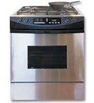
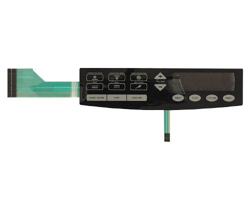
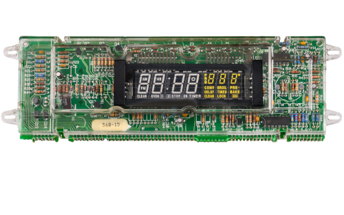
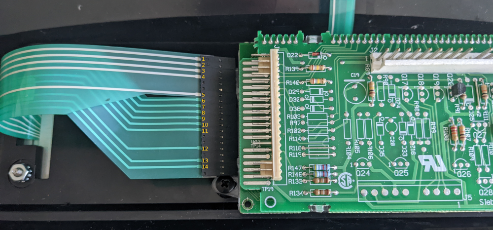
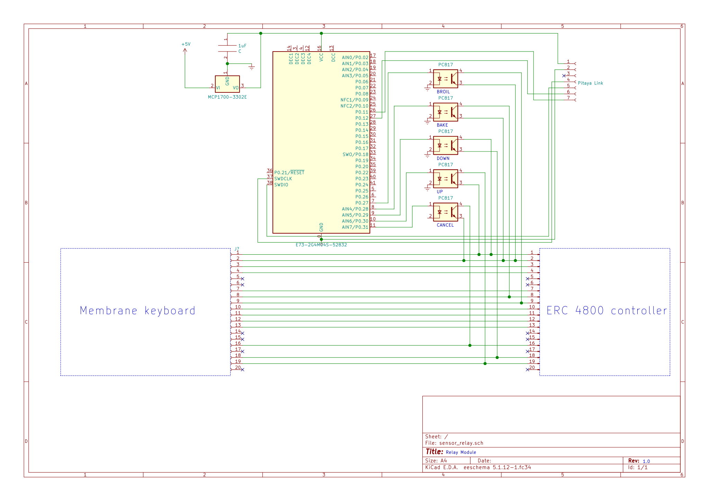
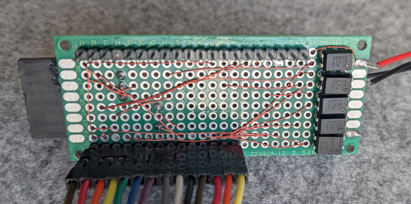
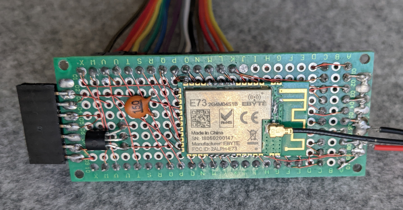
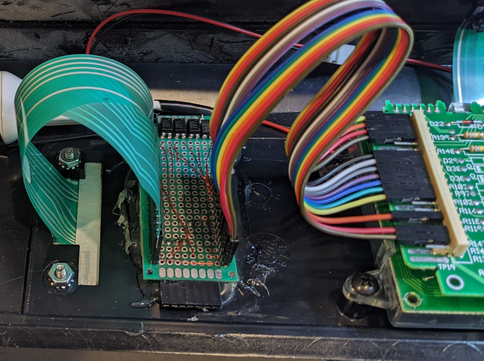
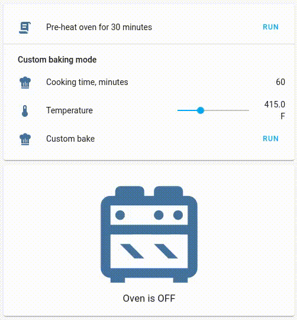

# Intro

The project aims to "smartify" a conventional "dump" home appliance cooking stove from Dacor.\
Current version allows simple programmatic control over oven's logic controller. No sensing or state validation is performed.\
This project perhaps can be a useful starting point for DIY automation enthusiasts. Similar approach can be used with any kind of appliance that uses matrix keyboard for input. Microwaves, fridges and probably many other household appliances that use [membrane keyboard](https://en.wikipedia.org/wiki/Membrane_keyboard) can be be "smartified" the same way.

Disclaimer: author is not affiliated by Dacor and just happened to be a stove owner.

# Why?

- it is fun
- to pre-heat the oven when you not at home yet, and want to toss pizza into hot oven when you are back
- to script recipes that operate at different temperature modes (i.e cook att 400F for 1 hour, then keep warm at 300F for 3 hours)

# How?

- A small DIY module
  - uses nRF52 MCU
  - wired to both membrane keyboard and stove control module
  - talks over the air to Home Assistant gateway

- Home Assistant integration
  - lovelace card
  - cooking scripts!

# Hardware

The oven's control panel comes with so-called "touchpad" (Dacor schematic refers to it as "oven membrane switch panel"): \
\
which is connected to the control board (Dacor 62692, referenced as "ERC 4800 controller") by blue 20-pin flex cable (for some reason schematics calls it "membrane pigtail"):\
\
Reverse side of the control board, flex cable unplugged disconnected.\ Note: the lines are identified by numbers 1-14:\

I found schematics on Dacor website:

Looks like ERC 4800 controller drives load switches that turn on/off various heating elements. We do not plan to take over the controller function, but we can inject key presses.

## Mapping the membrane keyboard

Since flex cable has 14 lines and control panel has 14 keys I originally assumed it was shared bus ground and each button had its own wire. However, my attempts to test continuity with multimeter were futile.
Turned out, it is a classic matrix keyboard and the controller is doing rows/columns scanning. In order to figure out what key connected to what line and create a map, I used a [simple sketch](scanner/matrix_scanner.ion)
on Arduino to scan the keyboard and figure out the map. Here is the output:

| Oven button     | Lines        |
| --------------- | ------------ |
| Convention bake | 2-9          |
| Convention broil| 2-10         |
| Pure convention | 2-11         |
| Broil           | 2-7          |
| Bake            | 2-6          |
| Clean           | 2-8          |
| Cancel          | 5-12         |
| Light           | not connected|
| Cook time       | 4-7          |
| plus/up         | 1-14         |
| minus/down      | 1-13         |
| timer 1         | 3-6          |
| clock           | 3-7          |
| stop time       | 3-8          |
| timer 2         | 4-5          |

One interesting aspect is that ERC 4800 seems to be using several voltage levels.
Here are voltages I read with multimeter on individvual pins:

| Line         | Voltage      |
| ------------ | ------------ |
| 1,5          | 0v           |
| 3,4,13,14    | 5v           |
| 2            | 14v          |
| 6,7,8,9,10,11| 0.2v         |
| 12           | 30v          |

## The relay module

The $5 EBYTE E73 module comes with nRF52832 MCU soldered on a small breakout board (1.27mm half-holes). It drives a bunch of optical insulators. These act as regular transistors but allow dealing with voltages higher than nRF module supports. The MCU acts as MySensors node and uses the available ESB radio to talk to MySensors Controller (for me it is Home Assistant with its MySensors Gateway).

### Theory of operation

The module is mostly passive and does not interfere with normal oven operation.
However it contains circuitry that allows it to "inject" key presses.

### Power

I hooked up regular USB charger to mains (+110V) from the stove to get 5V from USB.
MCP1700 or LE33A LDO can be used to get regulated 3.3V. 

### Schematics v1

### Relay module

Hand-soldered, dual-sided PCB hosts headers and the MCU.

Front: \

Back: \
E73 comes with 1.27mm holes, so it can't be soldered on 2.54mm header.\
I just used hot glue to affix E73 to the solderable PCB:

I used hot glue (yes, again!) to attach the module to back side of front panel: \

# Software

## Firmware
The module is built with MySensors and Arduino IDE can be used to flash it as well.
Follow [this guide](https://forum.mysensors.org/topic/9266/guide-nrf5-nrf51-nrf52-for-beginners) to setup Arduino IDE for nRF52 and MySensors.
Flash with IDE. I used [Pitaya Link](https://wiki.makerdiary.com/pitaya-link/) to flash (and develop) the module.

  - [sketch source](/DacorOvenController/DacorOvenController.ino)

## UI in Home Assistant

In order for the relay module to talk to Home Assistant (or any other [controller](https://www.mysensors.org/controller) of your choice), a gateway module
needs to be made, so that Home Assistant can talk to MySensor-based devices.

### Switches

Once the node connects to Home Assistant, MySensor integration will automatically create the following switches for you:
 - switch.cancel_reset
 - switch.down
 - switch.up
 - switch.bake
 - switch.broil

Switching them to "off" in HA will cause the module to inject respective button press.

### Visualization

I used [Custom Button Card](https://github.com/custom-cards/button-card) and Horizontal Stack cards to visualize oven status and run some useful scripts.

- [lovelace card](home_assistant/lovelace)
- [scripts](home_assistant/scripts.yaml)
